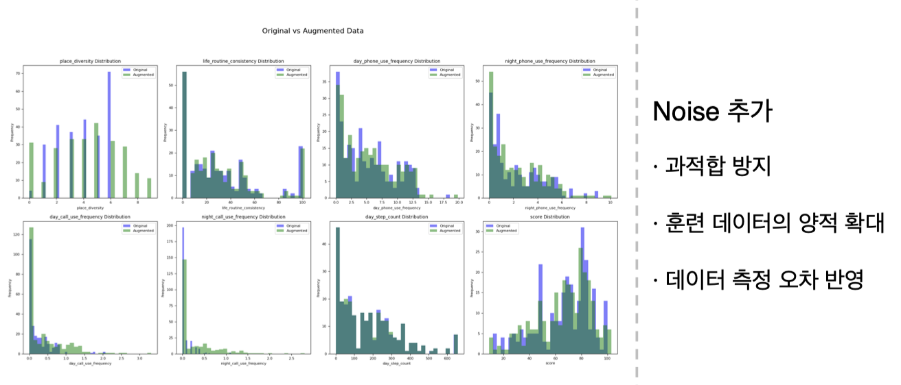

# FINAL-AI

AI 기반 우울감 예측 및 챗봇 시스템

## 프로젝트 개요

현대 사회에서 정신건강 관리는 개인의 삶의 질에 중요한 영향을 미칩니다. 우울증 등 다양한 정신건강 문제는 일상생활에 큰 영향을 줄 수 있지만, 이를 적시에 인지하고 관리하기란 쉽지 않습니다. 이러한 문제를 해결하기 위해 기술 발전은 디지털 솔루션을 제공하여 모바일 기기 등을 통해 정신건강 상태를 모니터링하고 평가하는 데 도움을 주고 있습니다.

본 프로젝트에서는 사용자의 센서 데이터를 모니터링하고, 우울감을 완화하기 위한 케어봇 시스템을 개발하는 것을 목표로 설정하였습니다. 제안 시스템은 스마트폰 센서 데이터와 채팅 데이터를 기반으로 정신건강 상태를 측정하고 개선에 도움이 되는 피드백을 사용자에게 제공합니다.

## 시스템 아키텍처

### 우울감 예측용 데이터 증강 및 전처리
 

### 우울감 예측용 앙상블 모델 및 베이지안 최적화
 


---

### 챗봇 시스템 전체 플로우


### 의도 분류 및 센서 데이터 기반 질의응답
 

### 용어설명 및 기타(일상 대화)
 

## 프로젝트 구조

```
FINAL-AI/
├── score_prediction/          # 우울감 예측 시스템
│   ├── model_train/          # 모델 훈련 관련
│   │   ├── ensemble.py       # 앙상블 모델 훈련
│   │   └── get_data.py       # 데이터 수집
│   ├── data_preprocess/      # 데이터 전처리
│   │   └── data_generative.ipynb
│   └── util/                 # 유틸리티 함수
│       ├── predict_score.py  # 점수 예측
│       └── preprocess_data.py
├── chatbot/                  # 챗봇 시스템
│   ├── app.py               # Flask 웹 서버
│   ├── chat_module/         # 챗봇 핵심 모듈
│   │   ├── qa_chatbot.py    # 메인 챗봇 로직
│   │   ├── term_explain.py  # 용어 설명
│   │   ├── sql_prompt.py    # SQL 쿼리 생성
│   │   ├── text_generation.py
│   │   └── translator.py
│   ├── models/              # AI 모델
│   │   └── intent/          # 의도 분류 모델
│   ├── utils/               # 유틸리티
│   ├── train_tools/         # 모델 훈련 도구
│   ├── config/              # 설정 파일
│   └── data/                # 훈련 데이터
├── images/                  # 시스템 아키텍처 이미지
└── README.md
```

## 주요 기능

### 1. 우울감 예측 시스템 (`score_prediction/`)

#### 앙상블 모델 기반 예측
- **다중 모델 조합**: GradientBoosting, XGBoost, LightGBM, RandomForest를 동시에 활용
- **가중 평균 예측**: 각 모델의 RMSE 점수를 기반으로 한 가중 평균으로 최종 예측값 도출
- **교차 검증**: 5-fold cross validation을 통한 모델 성능 검증

#### 개인화 모델 (Fine-tuning)
- **사용자별 맞춤 모델**: 개인 데이터가 5개 이상인 경우 자동으로 Fine-tuning 수행
- **베이지안 최적화**: Bayesian optimization을 통한 하이퍼파라미터 자동 튜닝
- **모델 저장 및 관리**: 사용자별로 개별 모델 파일 관리 (`{user_id}_fine_tuned.joblib`)

#### 데이터 전처리 및 정규화
- **일상 생활 패턴 데이터**: 시간별 활동, 수면, 운동, 스마트폰 사용량 등
- **자동 정규화**: StandardScaler를 통한 특성별 정규화
- **실시간 처리**: 일일 데이터를 기반으로 실시간 우울감 점수 예측

#### 주요 파일:
- `ensemble.py`: 앙상블 모델 훈련 및 Fine-tuning 로직
- `predict_score.py`: 실시간 우울감 점수 예측 및 데이터베이스 저장
- `data_generative.ipynb`: 데이터 생성 및 전처리 파이프라인

### 2. 챗봇 시스템 (`chatbot/`)

#### 의도 분류 시스템
- **4가지 의도 분류**: 용어설명, 이유설명, 질의응답, 기타
- **CNN 기반 분류**: Convolutional Neural Network를 활용한 텍스트 분류
- **한국어 특화 처리**: KoNLPy Komoran을 통한 한국어 형태소 분석

#### 자연어 처리 파이프라인
- **문장 토큰화**: 입력 문장을 개별 단어 단위로 분리
- **불용어 제거**: 조사, 어미 등 의미 없는 요소 제거
- **단어 벡터화**: Word2Vec 기반 단어 임베딩
- **사용자 정의 사전**: 도메인 특화 용어 사전 활용

#### 응답 생성 시스템
- **용어/이유 설명**: 벡터 데이터베이스(Pinecone) 기반 유사도 검색
- **질의응답**: LangChain과 SQL 데이터베이스 연동을 통한 구조화된 데이터 조회
- **일상 대화**: Phi-2-KO 모델을 LoRA 파인튜닝하여 공감적 응답 생성

#### 데이터베이스 연동
- **Firebase**: 사용자와의 대화 기록 저장 및 관리
- **MySQL**: 센서 데이터 및 일상 생활 패턴 데이터 저장
- **SQL DatabaseChain**: LangChain을 통한 자연어 → SQL 쿼리 변환
- **실시간 데이터 조회**: 핸드폰 사용량, 활동 패턴 등 실시간 데이터 분석

#### 주요 파일:
- `app.py`: Flask 웹 서버 및 RESTful API 엔드포인트
- `qa_chatbot.py`: 메인 챗봇 로직 및 의도 분류 처리
- `term_explain.py`: 용어 설명 모듈 (벡터 DB 검색)
- `sql_prompt.py`: SQL 쿼리 생성 및 데이터베이스 연동
- `text_generation.py`: 텍스트 생성 모델 연동
- `translator.py`: 다국어 지원 기능

## 기술 스택

### 우울감 예측
- **Machine Learning**: scikit-learn, XGBoost, LightGBM
- **Data Processing**: pandas, numpy
- **Model Optimization**: Bayesian optimization
- **Model Persistence**: joblib, pickle

### 챗봇 시스템
- **Web Framework**: Flask
- **NLP**: Custom intent classification, NER
- **Database**: SQL (추세 데이터 조회)
- **Text Processing**: KoNLPy Komoran, 사용자 정의 사전
- **Vector Database**: Pinecone
- **Language Model**: PaLM 2, Phi-2-KO

## 설치 및 실행

### 1. 환경 설정
```bash
# Python 가상환경 생성 (권장)
python -m venv venv
source venv/bin/activate  # Windows: venv\Scripts\activate

# 필요한 패키지 설치
pip install -r requirements.txt
```

### 2. 우울감 예측 시스템 실행
```bash
cd score_prediction
python model_train/ensemble.py  # 모델 훈련
python util/predict_score.py    # 점수 예측
```

### 3. 챗봇 시스템 실행
```bash
cd chatbot
python app.py
```

서버가 실행되면 `http://localhost:5000`에서 챗봇 API에 접근 가능

### API 사용 예시
```bash
curl -X POST http://localhost:5000/chat \
  -H "Content-Type: application/json" \
  -d '{"request": "우울감이 무엇인가요?"}'
```

## 설정

### 데이터베이스 설정
- 우울감 예측을 위한 일상 생활 패턴 데이터베이스 연결 필요
- 챗봇의 추세 조회를 위한 데이터베이스 설정 필요

### 모델 파일
- 의도 분류 모델: `chatbot/models/intent/intent_model_v2.h5`
- 사전 파일: `chatbot/train_tools/dict/chatbot_dict.bin`

## 데이터 구조

### 우울감 예측 데이터
- 일상 생활 패턴 데이터 (시간별 활동, 수면, 운동 등)
- 사용자별 개인화된 우울감 점수

### 챗봇 훈련 데이터
- 의도 분류 훈련 데이터: `chatbot/data/new_train_data_intent.csv`
- 용어 설명 및 추세 데이터